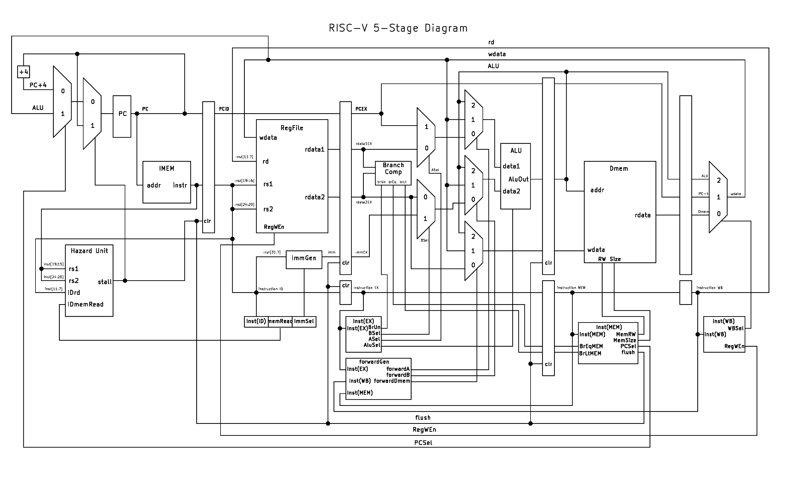

# RISC-V 5-Stage Pipelined CPU

This project implements a 5-stage pipelined RISC-V CPU in Verilog. It supports the RV32I instruction set and includes full forwarding, hazard detection, and branch flushing logic. It also supports 3 privilege levels, privileged instructions and exception handling. The design was developed and simulated using Vivado and verified using RISC-V assembly programs.

# Features
- Full RISC-V instruction set
- 5-Stage pipeline design
- Hazard Handling
- GShare Branch Predictor
- U S and M privilege levels
- CSR Read Write Instructions
- Basic Trap Handling with mtvec csr
- SV32 Virtual Memory System

# Diagram

# Resources Used
- Vivado
- KiCad for diagram
- Berkley's [CS61C Reference Card](https://cs61c.org/sp25/pdfs/resources/reference-card.pdf)

# Next Steps
- Implement UART Loader for faster testing
- Allow connecting to peripherals with memory-mapped io
- Test and Run xv6 OS
